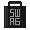

# Hacktoberfest 2019 Swag

[![Web Version](https://img.shields.io/badge/-Web%20Version-brightgreen.svg?logo=data:image/svg+xml;base64,PHN2ZyBhcmlhLWxhYmVsbGVkYnk9InNpbXBsZWljb25zLWdvb2dsZWNocm9tZS1pY29uIiByb2xlPSJpbWciIHZpZXdCb3g9IjAgMCAyNCAyNCIgeG1sbnM9Imh0dHA6Ly93d3cudzMub3JnLzIwMDAvc3ZnIj48dGl0bGUgaWQ9InNpbXBsZWljb25zLWdvb2dsZWNocm9tZS1pY29uIj5Hb29nbGUgQ2hyb21lIGljb248L3RpdGxlPjxwYXRoIGQ9Ik0xNi4yMTQgOC42OWw2LjcxNS0xLjY3OUExMi4wMjcgMTIuMDI3IDAgMCAxIDI0IDExLjk3MkMyNCAxOC41NyAxOC41NjkgMjQgMTEuOTY4IDI0Yy0uMzAyIDAtLjYwNS0uMDExLS45MDctLjAzNGw0LjkwNS04LjM0N2MuMzU2LS4zNzYuNjU1LS44MDMuODgxLTEuMjcxYTUuNDUxIDUuNDUxIDAgMCAwLS4wNDMtNC43NDggNS4xNTYgNS4xNTYgMCAwIDAtLjU5LS45MXptLTMuMjQgOC41NzVsLTIuMTIxIDYuNjgyQzQuNzM4IDIzLjM0NSAwIDE4LjE0IDAgMTEuOTc3IDAgOS41OTIuNzA5IDcuMjYgMi4wMzggNS4yNzlsNC44MzQgOC4zNzdjLjE4LjUzOSAxLjExOSAyLjU4MSAzLjA2NyAzLjMyNy45OTguMzgyIDIuMDQxLjQ4MSAzLjAzNS4yODJ6TTExLjk3MyA3LjYyYy0yLjAwNi4wMTktMy44NzggMS41NDQtNC4yODEgMy41MTJhNC40NzggNC40NzggMCAwIDAgMS4yMzcgNC4wMzJjMS4yMTQgMS4xODYgMy4xNCAxLjU3OCA0LjczNC45MjcgMS40MDgtLjU3NiAyLjQ3LTEuOTI3IDIuNjkxLTMuNDMxLjI3Mi0xLjg1Ni0uNzg4LTMuODMyLTIuNDk1LTQuNjI5YTQuNDEzIDQuNDEzIDAgMCAwLTEuODg2LS40MTF6TTcuMDQ2IDkuOTYyTDIuMjU5IDQuOTYzQTEyLjA0MyAxMi4wNDMgMCAwIDEgMTEuOTk3IDBjNC41NiAwIDguNzQ0IDIuNTkyIDEwLjc3NCA2LjY3NUgxMi41NThjLTEuODExLS4xMjUtMy4yODguNTItNC4yNjUgMS40NTNhNS4zNDUgNS4zNDUgMCAwIDAtMS4yNDcgMS44MzR6Ii8+PC9zdmc+)](https://benbarth.github.io/hacktoberfest-swag/)

Looking for hacktoberfest swag? You've come to the right place.

## What is hacktoberfest?
"Hacktoberfest is a month-long celebration of open source software." - DigitalOcean

Hacktoberfest is open to everyone. For the [official limited edition Hacktoberfest shirt](https://hacktoberfest.digitalocean.com/), _you must register and make four pull requests_ in the month of October - you can even contribute to this repository! You can sign up at <https://hacktoberfest.digitalocean.com>.

Hacktoberfest® encourages participation in the open source community.

In all of the hacktoberfest excitement, many companies want to join the celebration by rewarding their contributors with even more swag! That's why we're here!

| Who / Sponsors | What | How | Additional Details |
| :---: | :---: | :---: | --- |
| **DigitalOcean + DEV** | ** ** | **Four pull requests to any public repo on GitHub.** | **<https://hacktoberfest.digitalocean.com/>** (Verified 2019) |
| Accord |   | Create one or more merged pull requests to Accord Project. | <https://www.accordproject.org/events/hacktoberfest-2019/> (Verified 2019) |
| Appwrite |  | Create one or more merged pull requests to any Appwrite repository. | <https://medium.com/appwrite-io/hacktoberfest-2019-is-almost-here-lets-celebrate-it-together-24b311236dd> (Verified 2019) |
| Aqua Security |    | 1 Contribution: OSS superhero sticker pack, 3 Contributions: OSS superhero sticker pack and a special edition Aqua Hacktoberfest t-shirt, 5 Contributions: all of the above and the "Kubernetes Security" book, co-authored by Liz Rice, VP Open Source Engineering   | <https://blog.aquasec.com/aqua-open-source-security-hacktoberfest> (Verified 2019) |
| Circle CI |   | 1 to 3 pull requests: Limited-Edition Sticker. 4+ pull requests: Limited-Edition T-shirt | <https://circleci-public.github.io/hacktoberfest/#/> (Verified 2019) |
| Coding Blocks |   | 1 to 3 pull requests: Limited-Edition T-shirt . 5+ pull requests: Limited-Edition BAG | <https://blog.codingblocks.com/2019/cb-hacktoberfest-2019/> (Verified 2019) |
| Devfolio |   | 4 or more pull requests: Limited-Edition Sticker, If your PRs turn out to be exceptional: Limited-Edition T-shirt | <https://devfolio.co/blog/hacktoberfest-2019-devfolio/> (Verified 2019) |
| Gatsby |  | "1 PR: Level 1 swag; 5 PRs: Level 2 swag" | <https://github.com/gatsbyjs/store.gatsbyjs.org> |
| Globo.com |  | "1 merged PR: 👕". Any repo on [Globo.com](https://github.com/globocom)| <https://opensource.globo.com/hacktoberfest/> |
| Hasura |   | "Make a PR to [The Hasura GraphQL Engine](https://github.com/hasura/graphql-engine) or [The GraphQL Tutorial Series](https://github.com/hasura/learn-graphql). 2 hacktoberfest PRs for a 👕." | <https://blog.hasura.io/hasura-joins-hacktoberfest-2019/> (Verified 2019) |
| JabRef |   | 1 merged pull request: sticker, 5 merged pull requests: 👕. Any repo on <https://github.com/jabref/>. | <https://www.jabref.org/hacktoberfest/2019.html> (Verified 2019) |
| Kong |  | "If your Pull Request to Kong/kong was accepted, and it fixes a bug, adds functionality, or makes it significantly easier to use or understand Kong, congratulations! You are eligible to receive the very special Contributor T-shirt! Go ahead and fill out the Contributors Submissions form." | <https://github.com/Kong/kong/blob/master/CONTRIBUTING.md#contributor-t-shirt> (Verified 2019) |
| LadybugTools |  | 1 or more pull request | <https://discourse.ladybug.tools/t/celebrate-hacktoberfest-2019-with-ladybug-tools/7314> (Verified 2019) |
| LBRY |  | "A sweet LBRY sticker for 1 PR, T-shirt for a Good PR and 10,000 LBC for first PR of this month" | <https://lbry.com/news/hacktoberfest-2019> (Verified 2019) |
| Magento / Adobe |  | "submit 5 pull requests to either <https://github.com/magento> or <https://github.com/adobe>" | <https://community.magento.com/t5/Magento-DevBlog/Squashtoberfest-2019/ba-p/143694> (Verified 2019) |
| MayaData |    | "anyone who submits a pull request to one of our [github repos](https://github.com/openebs)" gets a 👕, BEST PR gets a 💻 | <https://blog.mayadata.io/mayadata-celebrates-hacktoberfest-2019> (Verified 2019) |
| Operation Code |   | "Resolve 3 issues and receive a white or black t-shirt! Merge 2 pull requests and receive stickers!" | <https://github.com/OperationCode/START_HERE> (Verified 2019) |
| Opsdroid |  | "Solve issues or improve documentation. 5–10 contributions is probably sticker worthy" | <https://medium.com/opsdroid/contributor-sticker-packs-738058ceda59> (Verified 2019) |
| Parity |  | anyone who makes a significant contribution is eligible for a limited edition gym bag | <https://www.parity.io/hacktoberfest-2019-parity/> (Verified 2019) |
| QMK |  | Interact 4 times with a [QMK repo](https://github.com/qmk) OR donate $15 to [cKeys](https://www.paypal.com/cgi-bin/webscr?cmd=_s-xclick&hosted_button_id=8UQUNVFE9H6QY&source=hacktoberfest) | <https://hacktoberfest.qmk.fm/> (Verified 2019)
| SAP |  | "a book from sap press for the user who create more pull requests in the ABAP Projects" | <https://blogs.sap.com/2019/10/04/lets-code-share-and-learn.-calling-abapers-to-next-edition-of-hacktoberfest/> (Verified 2019) |
| Sense/Net |  | "The first 100 participants who make a pull request" | <https://community.sensenet.com/blog/2019/10/01/hacktoberfest-is-here> (Verified 2019) |
| Umbraco |  | "you’ll need to have at least 1 PR approved on any Umbraco repository" | <https://umbraco.com/blog/hacktoberfest-2019/> (Verified 2019) |
| Uno |   | "anyone who contributes a pull request to the Uno Platform on GitHub between October 1 and October 31 will receive a Uno Platform T-shirt plus some limited edition swag." | <https://platform.uno/uno-is-joining-hacktoberfest-2019/> (Verified 2019) |
| Valor |   | 1 PR: pen and sticker. 3 PRs: notepad or wooden phone stand. 5 PRs: pen, sticker, notepad, and a wooden phone stand. | <https://valor-software.com/articles/hacktoberfest-2019-is-coming-and-ngx-bootstrap-strives-for-your-attention.html> (Verified 2019) |

[View some of this cool swag on Twitter.](https://twitter.com/search?q=%23hacktoberfest%20%23swag)

Open source is changing the world – one pull request at a time.

## Contribute

Looking for a Hacktoberfest issue? 👉 <https://github.com/search?utf8=✓&q=label%3AHacktoberfest&type=Issues>

Looking for a good first issue? 👉 <https://github.com/search?utf8=✓&q=label%3A"good+first+issue"&type=Issues> or go to [Up For Grabs](https://up-for-grabs.net/#/).

Know of another hacktoberfest swag opportunity? Send a [pull request](https://github.com/benbarth/hacktoberfest-swag/pulls)!
