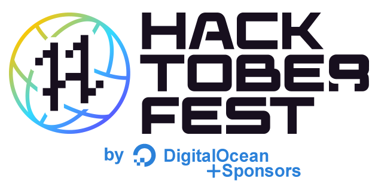

# Hacktoberfest <!-- current year start -->2020<!-- current year end --> Swag

Looking for Hacktoberfest swag? You've come to the right place.

## What is Hacktoberfest?
"Hacktoberfest is a month-long celebration of open source software." - _DigitalOcean_

Hacktoberfest is open to everyone. For the [official limited edition Hacktoberfest shirt](https://hacktoberfest.digitalocean.com), _you must register and make four pull requests_ in the month of October - you can even contribute to this repository! You can sign up at [hacktoberfest.digitalocean.com](~~https://hacktoberfest.digitalocean.com~~).

Hacktoberfest® encourages participation in the open source community.

In all of the hacktoberfest excitement, many companies want to join the celebration by rewarding their contributors with even more swag! That's why we're here!

**Quantity is fun, quality is key. Participating in Hacktoberfest leads to personal growth, professional opportunities, and community building. However, it all begins with meaningful contributions to open source software.**

## Verified participants <!-- current year start -->2020<!-- current year end -->
<!-- verified start -->
| Who / Sponsors | What | How | Additional Details |
| :---: | :---: | :---: | --- |
| **[DigitalOcean + Sponsors](https://www.digitalocean.com)** | ** ** | **Four pull requests to any public repo on GitHub.** | **[Details](https://hacktoberfest.digitalocean.com)** |
| [Appwrite](https://appwrite.io) |    | Create one or more merged pull requests to any Appwrite repository (https://github.com/appwrite). _Stickers, Magnets, Buttons, and T-shirts_ | [Details](https://medium.com/appwrite-io/celebrate-hacktoberfest-20-with-appwrite-1356337e2159) |
| [Camunda](https://camunda.com) |   | 2+ pull requests in any Camunda BPM, Zeebe, bpmn.io, etc, repository	 | [Details](https://camunda.com/hacktoberfest2020) |
| [Circle CI](https://circleci.com) |   | 1 to 3 pull requests: Limited-Edition Sticker. 4+ pull requests: Stickers + Limited-Edition T-shirt | [Details](https://hacktoberfest.circleci.com/) |
| [Globo](https://opensource.globo.com) |  | 1 merged PR: 👕. Any repo on [Globo.com](https://github.com/globocom) | [Details](https://opensource.globo.com/hacktoberfest/) |
| [Hasura](https://hasura.io) |   | Submit a PR for one of our issues with the label hacktoberfest: For all valid PRs attempting to close an issue labelled hacktoberfest, we’ll send out some amazing Hasura - Hacktoberfest swag | [Details](https://hasura.io/blog/hasura-joins-hacktoberfest-3rd-year-in-a-row/) |
| [InfraCloud](https://www.infracloud.io) |   | Make a PR or more on InfraCloud’s open-source projects – Fission or Botkube. To deliver the swags, we will reach out to you once PR(s) gets merged. A person with maximum merged PRs will also get a Kindle from our side | [Details](https://twitter.com/infracloudio/status/1310980826541092865) |
| [JetBrains](https://www.jetbrains.com) |  | If you complete Hacktoberfest (you’ve submitted four or more valid pull requests on GitHub), we will send you a coupon code covering 3 months of your new All Products Pack subscription at the end of the Hacktoberfest event. When that expires, you will also get 20% off an annual subscription. If you already have a personal license for a JetBrains tool, the same coupon code you get upon the Hacktoberfest completion will add 3 months to your existing subscription (any JetBrains IDE, .NET tool, or the All Products Pack) | [Details](https://www.jetbrains.com/lp/hacktoberfest-2020) |
| [Kong](https://konghq.com) |  | If your Pull Request to Kong/kong was accepted, and it fixes a bug, adds functionality, or makes it significantly easier to use or understand Kong, congratulations! You are eligible to receive the very special Contributor T-shirt! Go ahead and fill out the Contributors Submissions form | [Details](https://github.com/Kong/kong/blob/master/CONTRIBUTING.md#contributor-t-shirt) |
| [lakeFS](https://lakefs.io) |   | 1 PR on our GitHub repo for a collection of stickers, 2 or more gets stickers and a lakeFS t-shirt 👕 | [Details](https://docs.lakefs.io/contributing#get-ready-for-hacktoberfest) |
| [LoginRadius](https://www.loginradius.com) |  | LoginRadius will be part of hacktoberfest and yes, we are here with some cool swags. We have got around 500 t-shirts for people contributing to our open source repositories | [Details](https://www.loginradius.com/engineering/blog/loginradius-supports-hacktoberfest-2020) |
| [MayaData](https://mayadata.io) |   | When your PR to any of the repositories ([OpenEBS](https://github.com/openebs/openebs) / [LitmusChaos](https://github.com/litmuschaos/litmus)) is merged, we will contact you to fill out a form to send a special edition swags designed for Hacktoberfest. BEST PR wins a grand prize. Remember, no contribution is too small, and everyone was a rookie at some point in time. From documentation updates to bug fixes or small feature improvements, every pull request has value and helps make the world a better place | [Details](https://blog.mayadata.io/celebrate-hacktoberfest-2020-open-source-with-mayadata) |
| [Vonage (Nexmo)](https://www.vonage.com) |  | If you have made a valid contribution to one of our repos, you can choose to receive either a $5 Open Collective Gift Card or a pair of Bamboo Vonage Socks! | [Details](https://developer.nexmo.com/hacktoberfest) |
| [Webiny](https://www.webiny.com) |  | Find out about Webiny's hacktoberfest issues at our GitHub [project board](https://github.com/webiny/webiny-js/projects/12) to keep track of the hacks of October at Webiny Open Source projects 🥳

Go through the `hacktoberfest` labeled issues on the Webiny Open Source projects [here](https://github.com/search?q=org%3Awebiny+label%3Ahacktoberfest).

Or, you can grab one of the ideas from the notes in the [project board](https://github.com/webiny/webiny-js/projects/12) and open a new issue for it. Make sure to tag the newly created issue with the `hacktoberfest` label | [Details](https://dev.to/webiny/webiny-hacktoberfest-2020-49h4) |
<!-- verified end -->

## Unverified / Past participants
<!-- unverified start -->
| Who / Sponsors | What | How | Additional Details |
| :---: | :---: | :---: | --- |
| [Accord](https://accordproject.org) |   | Create one or more merged pull requests to Accord Project | [Details](https://accordproject.org/events/hacktoberfest-2019) |
| [Adobe / Magento](https://opensource.adobe.com) |  | Submit 5 pull requests to <https://github.com/adobe> or <https://github.com/magento> | [Details](https://opensource.adobe.com/squashtoberfest) |
| [Aqua Security](https://www.aquasec.com) |    | 1 Contribution: OSS superhero sticker pack, 3 Contributions: OSS superhero sticker pack and a special edition Aqua Hacktoberfest t-shirt, 5 Contributions: all of the above and the "Kubernetes Security" book, co-authored by Liz Rice, VP Open Source Engineering | [Details](https://blog.aquasec.com/aqua-open-source-security-hacktoberfest) |
| [Coding Blocks](https://codingblocks.com) |   | 1 to 3 merged pull requests: Limited-Edition T-shirt . 5+ merged pull requests: Limited-Edition BAG | [Details](https://blog.codingblocks.com/2019/cb-hacktoberfest-2019) |
| [Devfolio](https://devfolio.co) |   | 4 or more pull requests: Limited-Edition Sticker, If your PRs turn out to be exceptional: Limited-Edition T-shirt | [Details](https://devfolio.co/blog/hacktoberfest-2019-devfolio) |
| [Flutterwave](https://flutterwave.com) |  | 2 or more pull requests to any of the projects from https://developer.flutterwave.com/docs/plugins : Limited-Edition T-shirt | [Details](https://twitter.com/Ace_KYD/status/1183738026511519745) |
| [Gatsby](https://www.gatsbyjs.com) |  | 1 PR: Level 1 swag; 5 PRs: Level 2 swag | [Details](https://www.gatsbyjs.com/contributing/contributor-swag/) |
| [JabRef](https://www.jabref.org) |   | 1 merged pull request: sticker, 5 merged pull requests: 👕. Any repo on <https://github.com/jabref/> | [Details](https://www.jabref.org/hacktoberfest/2019.html) |
| [Jenkins](https://jenkins.io) |    | PR to any repositories under featured repositories. The PR must be at least raised in October 2019 and you should not be inactive for seven days or more during code review. Guaranteed Swag for Top 20 contributors, and rest is to be decided. Check the announcement on the blog | [Details](https://jenkins.io/events/hacktoberfest) |
| [Ladybug Tools](https://www.ladybug.tools) |  | 1 to 3 merged pull requests: Limited-Edition T-shirt . 5+ merged pull requests: Limited-Edition BAG | [Details](https://discourse.ladybug.tools/t/celebrate-hacktoberfest-2019-with-ladybug-tools/7314) |
| [LBRY](https://lbry.com) |  | A sweet LBRY sticker for 1 PR, T-shirt for a Good PR and 10,000 LBC for first PR of this month | [Details](https://lbry.com/news/hacktoberfest-2019) |
| [Les-Tilleuls.coop](https://les-tilleuls.coop) |  | To win a t-shirt, make 3 pull requests on API Platform's GitHub repositories by October 31st, and [then fill in this form](https://cooptilleuls.typeform.com/to/CG0pLd) | [Details](https://les-tilleuls.coop/fr/blog/article/celebrate-hacktoberfest-with-api-platform) |
| [Operation Code](https://operationcode.org) |   | Resolve 3 issues and receive a white or black t-shirt! Merge 2 pull requests and receive stickers! | [Details](https://github.com/OperationCode/START_HERE) |
| [Opsdroid](http://opsdroid.github.io) |  | Solve issues or improve documentation. 5–10 contributions is probably sticker worthy | [Details](https://medium.com/opsdroid/contributor-sticker-packs-738058ceda59) |
| [Parity](https://www.parity.io) |  | Anyone who makes a significant contribution is eligible for a limited edition gym bag	 | [Details](https://www.parity.io/hacktoberfest-2019-parity/) |
| [QMK](https://qmk.fm) |  | Interact 4 times with a [QMK repo](https://github.com/qmk) OR donate $15 to [cKeys](https://www.paypal.com/cgi-bin/webscr?cmd=_s-xclick&hosted_button_id=8UQUNVFE9H6QY&source=hacktoberfest) | [Details](https://hacktoberfest.qmk.fm) |
| [SAP](https://www.sap.com) |  | A book from sap press for the user who create more pull requests in the ABAP Projects | [Details](https://blogs.sap.com/2019/10/04/lets-code-share-and-learn.-calling-abapers-to-next-edition-of-hacktoberfest) |
| [Sense/Net](https://www.sensenet.com) |  | The first 100 participants who make a pull request | [Details](https://community.sensenet.com/blog/2019/10/01/hacktoberfest-is-here) |
| [Twilio](https://www.twilio.com) |   | One PR gets you a collection of stickers, 2 or more gets stickers and a pair of Twilio socks | [Details](https://www.twilio.com/blog/ahoy-hacktoberfest-2019) |
| [Umbraco](https://umbraco.com/) |   | You’ll need to have at least 1 PR approved on any Umbraco repository | [Details](https://umbraco.com/blog/hacktoberfest-2019/) |
| [Uno](https://platform.uno) |   | Anyone who contributes a pull request to the Uno Platform on GitHub between October 1 and October 31 will receive a Uno Platform T-shirt plus some limited edition swag | [Details](https://platform.uno/uno-is-joining-hacktoberfest-2019/) |
| [Valor](https://valor-software.com) |   | 1 PR: pen and sticker. 3 PRs: notepad or wooden phone stand. 5 PRs: pen, sticker, notepad, and a wooden phone stand | [Details](https://valor-software.com/articles/hacktoberfest-2019-is-coming-and-ngx-bootstrap-strives-for-your-attention.html) |
| [Xamarin / Microsoft](https://dotnet.microsoft.com/apps/xamarin) |    | 1 pull request for the stickers, 4 pull requests for a T-shirt, 10 pull requests to be eligible to win a trophy | [Details](https://devblogs.microsoft.com/xamarin/hacktoberfest-2019-xamarin-edition) |
<!-- unverified end -->

[View some of this cool swag on Twitter.](https://twitter.com/search?q=%23hacktoberfest%20%23swag)

Open source is changing the world – one pull request at a time.

## Contribute

Looking for a Hacktoberfest issue? 👉 <https://github.com/search?utf8=✓&q=label%3AHacktoberfest&type=Issues>

Looking for a good first issue? 👉 <https://github.com/search?utf8=✓&q=label%3A"good+first+issue"&type=Issues> or go to [Up For Grabs](https://up-for-grabs.net/#/).

Know of another hacktoberfest swag opportunity? Send a [pull request](https://github.com/benbarth/hacktoberfest-swag/pulls)! (Don't forget to review our [contribution guidelines](CONTRIBUTING.md).)
