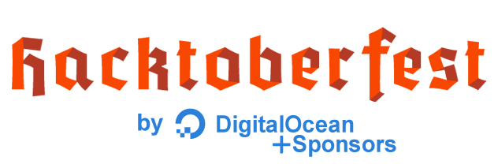

# Hacktoberfest Swag <!-- current year start -->2021<!-- current year end -->

Looking for Hacktoberfest swag? You've come to the right place.

## What is Hacktoberfest?

"Hacktoberfest is a month-long celebration of open source software." - _DigitalOcean_

Hacktoberfest is open to everyone. For the [official limited edition Hacktoberfest shirt](https://hacktoberfest.digitalocean.com), _you must register and make four pull requests_ in the month of October (to a repository with the _hacktoberfest_ label) - you can even contribute to this repository! You can sign up at [hacktoberfest.digitalocean.com](https://hacktoberfest.digitalocean.com).

Hacktoberfest® encourages participation in the open source community.

In all of the hacktoberfest excitement, many companies want to join the celebration by rewarding their contributors with even more swag! That's why we're here!

### The purpose of this list is to incentivise meaningful contributions. If you intend to make low-value changes -- just for swag. *Don't.*

## Verified participants <!-- current year start -->2021<!-- current year end -->
<!-- verified start -->
| Who / Sponsors | What | How | Additional Details |
| :---: | :---: | :---: | --- |
| [DigitalOcean + Sponsors](https://www.digitalocean.com) |   | Four pull requests to any participating public repo on GitHub or GitLab. Support open source and pick a limited edition T-shirt or plant a tree.  To reduce spam DigitalOcean introduced new measures on 2020: PRs count only if: **Submitted in a repo with the hacktoberfest topic AND during the month of October AND (The PR is merged OR The PR is labelled as hacktoberfest-accepted by a maintainer OR The PR has been approved)** | [Details](https://hacktoberfest.digitalocean.com/resources/participation) |
| [Appwrite](https://appwrite.io) |    | Create one or more merged pull requests to any Appwrite repository <https://github.com/appwrite>. _Stickers, Magnets, Buttons, and T-shirts_ | [Details](https://hacktoberfest.appwrite.io) |
| [DeepSource](https://deepsource.io/) |  | DigitalOcean will send DeepSource swag to all participants who create at least 4 pull requests during Hacktoberfest. Apart from this, if you're a maintainer participating in Hacktoberfest with DeepSource Discover with at least 20 contributions, we'll send special swag to you. Expect an e-mail from us in the second week of November '21. | [Details](https://deepsource.io/hacktoberfest/) |
| | | | |
| [Alpaca](https://alpaca.markets/) |  | In addition, if you’re one of the first 20 participants to submit one or more successfully merged pull requests to our open source projects and any contributions to the community-built SDKs, such as Java and R ones, as well as anything that uses Alpaca API, you’ll receive an Alpaca T-shirt. | [Details](https://alpaca.markets/blog/hacktoberfest-2021-celebrate-open-source-with-alpaca/) |
| [Appsmith](https://www.appsmith.com) |    | We've got some special Appsmith swag for you! The more you contribute, the more we ship! Please make sure to read the terms and conditions and the FAQs. | [Details](https://hacktoberfest.appsmith.com/) |
| [ArchivesSpace](https://archivesspace.org/) |  | The community member who submits the most pull requests in the month of October will receive an ArchivesSpace swag bag! | [Details](https://archivesspace.org/archives/7147) |
| [AutoDL](https://auto-dl.tech/) |   | Swags for top contributors in AutoDL repositories. | [Details](https://dev.to/mctechie/autodl-celebrates-hacktoberfest-2021-25da) |
| [Automation Panda](https://automationpanda.com/) |  | To encourage contributions, I will give free Boa Constrictor stickers to anyone who makes a valid pull request to the project during Hacktoberfest 2021! | [Details](https://automationpanda.com/2021/10/04/boa-constrictor-is-doing-hacktoberfest-2021/) |
| [Bitrise](https://www.bitrise.io) |   | Contribute with four or more pull requests to any of our open issues labeled Hacktoberfest and fill out our form after that. | [Details](https://www.bitrise.io/hacktoberfest-2021) |
| [Bridgecrew](https://bridgecrew.io/event/2021-hacktoberfest/) |   | Submit one contribution and you’ll receive a super ghoul sticker pack. Submit two or more contributions and you’ll receive a swag pack complete with stickers and a wicked t-shirt. | [Details](https://bridgecrew.io/event/2021-hacktoberfest/) |
| [Camunda](https://camunda.com) |   | Participants who complete the Camunda challenge from October 1-31 will earn a limited edition Camunda x Hacktoberfest t-shirt as well as nifty stickers. | [Details](https://camunda.com/hacktoberfest2021/) |
| [CodeSee](https://www.codesee.io) |    | After completing OSS Port x Hacktoberfest Challenges fill out the form located below challenges rules. | [Details](https://www.oss-port.com/swag/) |
| [Creative Tim](https://www.creative-tim.com) |  | we are offering a special Creative Tim T-shirt for ten collaborators on our open-source | [Details](https://www.creative-tim.com/blog/creative-tim/open-source-projects-for-hacktoberfest/) |
| [DagsHub](https://dagshub.com) |  | DagsHub will send swag to all participants who create at least 2 pull requests during Hacktoberfest. If you make more than 10 pull requests, we'll send special swag your way! | [Details](https://dagshub.com/blog/hacktoberfest-x-dagshub-2) |
| [Datenanfragen.de e. V.](https://www.datarequests.org) |   | The first 100 participants who submit a pull request or a patch that is accepted by us to one of the qualifying repositories between October 1, and November 1, will get a free sticker set. In addition, we are awarding 10 t-shirts for the best contributions. Our board will select those winners after the event is over. | [Details](https://www.datarequests.org/blog/hacktoberfest-2021/) |
| [Earthly](https://www.earthly.dev) |  | The first 40 participants who submit at least one pull request that is accepted Earthly’s GitHub Repository between October 1, 2021 and November 1, 2021, will get an earthly sticker.  We have labeled many issues hacktoberfest to get you started. You can also qualify for the sticker by adding a working Earthfile file to another open-source project, including your own personal project. | [Details](https://earthly.dev/blog/hacktoberfest-2021/) |
| [Flyte](https://flyte.org/) |    | Create 2 or more merged pull requests to any of the flyte github repositories. The first 15 contributors will get a mug irrespective of the number of merged pull requests. | [Details](https://blog.flyte.org/meet-flyte-at-hacktoberfest-2021) |
| [Globo](https://opensource.globo.com) |  | 2 PR + min. 1 merged PR: 👕. Any repo on [Globo.com](https://github.com/globocom). Please note, that delivery might be limited to Brazil! | [Details](https://opensource.globo.com/hacktoberfest/) |
| [Hackclubmauritius](https://hackclubmauritius.nl/) |  | Complete at least 1 valid request you'll receive some stickers from Hack Club Mauritius | [Details](https://allevents.in/online/hack-club-mauritius-hacktoberfest-2021/10000179108236557) |
| [Jenkins](https://jenkins.io) |  | During this event everyone can support open-source by contributing changes, and then earn a limited edition swag. | [Details](https://www.jenkins.io/events/hacktoberfest/) |
| [Kong](https://konghq.com) |  | If your Pull Request to Kong/kong was accepted, and it fixes a bug, adds functionality, or makes it significantly easier to use or understand Kong, congratulations! You are eligible to receive the very special Contributor T-shirt! Go ahead and fill out the Contributors Submissions form. | [Details](https://github.com/Kong/kong/blob/master/CONTRIBUTING.md#contributor-t-shirt) |
| [LoginRadius](https://www.loginradius.com) |   | Make one successful pull request in October to any open source [LoginRadius repository](https://github.com/LoginRadius) and earn a T-shirt and Swags! | [Details](https://www.loginradius.com/blog/async/hacktoberfest-2021/) |
| [Mattermost](https://mattermost.com/) |   | Limited edition Mattermost stickers to everyone who makes one or more contributions to the Mattermost community during Hacktoberfest. Additionally top contributors will receive a custom Mattermost mechanical keyboard. | [Details](https://mattermost.com/blog/hacktoberfest-2021/) |
| [MayaData](https://mayadata.io) |  | Once your PR is merged, we will get in touch with you to send special MayaData swags to you and the best PR will win a grand prize of Oculus VR Headset. | [Details](https://blog.mayadata.io/celebrate-hacktoberfest-2021-support-open-source-with-mayadata-openebs) |
| [Medusa](https://www.medusa-commerce.com/) |    | By actively participating in Hacktober fest, you make Medusa more sustainable and help us progress quickly. Every single contribution matters, and you’ll get an appreciation gift for your time and effort: One PR → Medusa sticker; Three PRs → Medusa t-shirt; Build a Plugin (issues labeled with plugin) → Complete Medusa pack (t-shirt, hoodie, sticker). | [Details](https://www.medusa-commerce.com/post/medusa-hacktoberfest-announcement) |
| [MeiliSearch](https://www.meilisearch.com) |  | MeiliSearch will send reusable insulated water bottles to all those who successfully participated in Hacktoberfest and contributed to the open-source projects of MeiliSearch (look for the repositories with the hacktoberfest topic). | [Details](https://blog.meilisearch.com/contribute-hacktoberfest-2021/) |
| [Milvus](https://milvus.io/) |    | By contributing to the Milvus project between October 1 and October 31 you’ll also earn some additional swag and prizes sponsord by Zilliz | [Details](https://milvus.io/hacktoberfest-2021/) |
| [Native Script](https://nativescript.org/) |    | Contribution can be in any of these forms: - Create a repo of anything you find fun or neat about NativeScript (small or large). - Create a video showing off your NativeScript skills. - Post a PR for an issue in any [NativeScript Repository](https://github.com/search?q=topic%3Ahacktoberfest+org%3ANativeScript&type=Repositories). - Share a gist of neat NativeScript code you find useful. - Create a NativeScript plugin. | [Details](https://blog.nativescript.org/hacktoberfest-2021/index.html) |
| [NMF.earth](https://nmf.earth) |  | Some issues are tagged with Stickers and if you complete any of them or a large task, I will send you a set of 3 gorgeous stickers made by Jenny Lelong ✌️ | [Details](https://medium.com/@nmf_earth/hacktoberfest-2021-carbon-diary-sustainable-guide-32fb4e5323c1) |
| [PayPal](https://www.paypal.com/) |  | In addition to [Hacktoberfest](https://hacktoberfest.digitalocean.com/)'s official T-shirts, the first 20 contributors will receive swag from PayPal! We welcome your contributions and are excited to see your pull requests! As a bonus, a randomly selected contributor will receive a TimBuk2 Parkside Backpack! | [Details](https://github.com/paypal/hacktoberfest) |
| [QuestDB](https://questdb.io/) |    | If you successfully contribute to QuestDB projects, we offer extra SWAG for you through our SWAG program! | [Details](https://questdb.io/community/) |
| [Stack Builders](https://www.stackbuilders.com/) |  | In addition to the official event, Stack Builders will be pitching in with some rewards for people who contribute. We’ll launch weekly challenges in October and hand out gift cards at the beginning of November to those who get the highest score from making top-value contributions to any open-source repository on GitHub or GitLab. | [Details](https://www.stackbuilders.com/news/it-s-hacktoberfest-time) |
| [Stepzen](https://stepzen.com) |   | As a plus, with every PR you merge or pairing session you complete, we'll send you a StepZen GraphQL sticker! | [Details](https://stepzen.com/blog/announcing-stepzens-hacktoberfest-goals-21) |
| [Stoplight](https://stoplight.io) |  | During October, for those who contribute to our open-source pull requests on Elements, Prism, or Spectral, we will donate 400 trees in our Stoplight forest for every successfully merged pull request. | [Details](https://blog.stoplight.io/opening-up-about-open-source-october-time-to-give-back) |
| [Supabase](https://supabase.io/new) |   | On Friday Oct 1st at 08:00am PT we're kicking things off with our Hacktoberfest Discord Hangout. Join us in the #hackathon channel on our Discord server: https://discord.gg/bnncdqgBSS - Then you have 10 days to build a new open-source project with Supabase or contribute to one of our supabase-community projects that have the hacktoberfest topic. - It can be whatever you want - a project, mobile app, tool, library, anything. - Enter as an individual, or as a team of up to 5 people. - Submission deadline is Sunday Oct 10th at 11:59pm PT. - Besides earning your Hacktoberfest shirt, you can win some extremely limited edition Supabase swag ✨ | [Details](https://supabase.io/new/blog/2021/09/28/supabase-hacktoberfest-hackathon-2021) |
| [Symbl.ai](https://symbl.ai) |   | If you contribute to our docs, raise an issue, or create a PR, with approval from the Symbl.ai team, you will be eligible for exclusive Symbl.ai stickers. Raise more than one issue or PR and be eligible for a Symbl.ai t-shirt as well! | [Details](https://www.eventbrite.com/e/hacktoberfest-with-symblai-tickets-187225746247) |
| [ToolJet](https://tooljet.io) |    | Every valid PR is eligible for ToolJet swag ( stickers, t-shirts, and more ). Additionally, we will select top contributors to receive special prizes. 1 valid PR - ToolJet stickers and t-shirt 3 valid PRs - ToolJet stickers, t-shirt, water bottle 4 valid PRs - ToolJet stickers, t-shirt, Hoodie, water bottle More than 4 valid PRs? A surprise gift is waiting for you along with all the goodies! | [Details](https://blog.tooljet.io/hacktoberfest-2021/) |
| [Zup](https://www.zup.com.br/) |  | Create 2+ pull request on any [ZupIT repo](https://github.com/ZupIT). The first 200 contributors from Brasil will receive a T-shirt. | [Details](https://insights.zup.com.br/hacktoberfest) |
<!-- verified end -->

## Unverified / Past participants
<!-- unverified start -->
| Who / Sponsors | What | How | Additional Details |
| :---: | :---: | :---: | --- |
| [Activeloop](https://www.activeloop.ai) |    | We've created a [GitHub project board](https://github.com/activeloopai/Hub/projects/2) to keep track of what's happening and can enjoy collaborating and hacking together! Regardless of what issue you will be resolving, any contribution will be rewarded with Activeloop swag! | [Details](https://www.activeloop.ai/hacktoberfest/) |
| [Aqua Security](https://www.aquasec.com) |    | We are looking for meaningful contributions to our open source products. It can be adding new features, fixing bugs, improving documentation, integrating with other software, or just creating content in other places that educates about our technology. By getting involved, you get a unique opportunity to apply your skills at the forefront of the cloud native security. | [Details](https://blog.aquasec.com/hacktoberfest-2020-aqua-open-source) |
| [Circle CI](https://circleci.com) |   | *Challenge 1* - 1 to 3 merged pull requests to include orb usage on an existing CircleCI config: Limited-Edition Sticker. 4+ pull requests: Stickers + Limited-Edition T-shirt; *Challenge 2* - Develop and publish an orb using the Orb Development Kit: limited edition orb magic pin. | [Details](https://hacktoberfest.circleci.com/) |
| [Commerce.js](https://commercejs.com/) |  | Submit one pull request to Commerce.js to win more cool swag! | [Details](https://commercejs.com/docs/hacktoberfest/) |
| [CrioDO](https://www.crio.do/) |    | For getting Swags the person should be registered and should be in Top 50 contributors . | [Details](https://www.crio.do/ibelieveindoing) |
| [Devfolio](https://devfolio.co) |   | 4 or more pull requests: Limited-Edition Sticker, Top 50 contributors : Limited-Edition T-shirt (ships swag in india only) | [Details](https://devfolio.co/blog/devfolio-hacktoberfest-2020) |
| [DX Heroes](https://developerexperience.io) |  | Top 3 contributors will receive a permanent Badge of Honor with links to their socials/websites on this repository. On top of that, the contributor with the most merged pull requests will receive exclusive DX Heroes merchandise! | [Details](https://github.com/DXHeroes/knowledge-base-content#hacktoberfest-2020-) |
| [Gatsby](https://www.gatsbyjs.com/) |  | Submit a PR that closes an issue in a Gatsby repository | [Details](https://github.com/gatsbyjs/gatsby/issues/27222) |
| [Hasura](https://hasura.io) |   | Submit a PR for one of our issues with the label hacktoberfest: For all valid PRs attempting to close an issue labelled hacktoberfest, we’ll send out some amazing Hasura - Hacktoberfest swag | [Details](https://hasura.io/blog/hasura-joins-hacktoberfest-3rd-year-in-a-row/) |
| [Indeed](https://www.indeed.com/) |  | Complete two or more pull requests in one of the repos maintained by Indeed employees to be eligible. Find open issues marked with the Hacktoberfest tag. An Indeed Open Source sweatshirt will be shipped to the US only. | [Details](https://engineering.indeedblog.com/indeed-hacktoberfest-2020) |
| [InfraCloud](https://www.infracloud.io) |   | Make a PR or more on InfraCloud’s open-source projects – Fission or Botkube. To deliver the swags, we will reach out to you once PR(s) gets merged. A person with maximum merged PRs will also get a Kindle from our side. | [Details](https://twitter.com/infracloudio/status/1310980826541092865) |
| [JetBrains](https://www.jetbrains.com) |  | If you complete Hacktoberfest (you’ve submitted four or more valid pull requests on GitHub), we will send you a coupon code covering 3 months of your new All Products Pack subscription at the end of the Hacktoberfest event. When that expires, you will also get 20% off an annual subscription. If you already have a personal license for a JetBrains tool, the same coupon code you get upon the Hacktoberfest completion will add 3 months to your existing subscription (any JetBrains IDE, .NET tool, or the All Products Pack). | [Details](https://www.jetbrains.com/lp/hacktoberfest-2020) |
| [Meedan](https://meedan.com/) |    | The only requirement is a valid PR accepted and merged on any of our open source projects and then we will send you a limited edition Meedan Hacktoberfest t-shirt and mask along with a sticker pack! | [Details](https://meedan.com/hacktoberfest) |
| [Operation Code](https://operationcode.org) |   | Resolve 3 issues and receive a white or black t-shirt! Merge 2 pull requests and receive stickers! | [Details](https://github.com/OperationCode/START_HERE) |
| [Parabeac](https://www.parabeac.com/) |  | Parabeac is giving 100 first contributor shirts to our top contributors on [Parabeac/Parabeac-Core](https://github.com/Parabeac/Parabeac-Core) for the month. | [Details](https://dev.to/parabeac/hacktoberfest-parabeac-open-source-design-to-flutter-code-1jg0) |
| [Sense/Net](https://www.sensenet.com) |   | The first 60 contributors (approved PR from our [dedicated GitHub board](https://github.com/orgs/SenseNet/projects/7)) get sensenet special edition socks. Every Hacktoberfest participant gets a 10% discount code for business plan (can be used one time for a monthly or yearly subscription till 31.12.2021.) | [Details](https://hacktoberfest.sensenet.com) |
| [specflow](https://specflow.org/) |  | 1+ merged PR Contributions, like Bugfixes, Features, and Documentation changes & fixes can be made in all our repositories. | [Details](https://specflow.org/blog/hacktoberfest-2020-starts-soon/) |
| [Switchblade](https://switchblade.xyz/) |   | Open three valid pull requests on switchblade repositories during October | [Details](https://github.com/SwitchbladeBot/switchblade/issues/1203) |
| [Tripal](https://tripal.info/) |   | Make four valid pull requests (PRs) between October 1-31 (in any time zone) to one of two repositories: Tripal core or t4d8, the temporary home for Tripal 4 development. | [Details](https://tripal.info/news/tripal-hacktoberfest-2020) |
| [Uno](https://platform.uno) |  | Anyone who contributes a meaningful pull request to the Uno Platform on GitHub between October 1 and October 31 will receive a Udemy course on Introduction to Uno Platform and enter the draw to receive one of 30 Uno Platform t-shirts. | [Details](https://platform.uno/blog/hacktoberfest-2020-contribute-to-uno-to-win-online-courses-and-t-shirts/) |
| [Vonage (Nexmo)](https://www.vonage.com) |  | If you have made a valid contribution to one of our repos, you can choose to receive either a $5 Open Collective Gift Card or a pair of Bamboo Vonage Socks! | [Details](https://developer.nexmo.com/hacktoberfest) |
| [Webiny](https://www.webiny.com) |  | Find out about Webiny's hacktoberfest issues at our GitHub [project board](https://github.com/webiny/webiny-js/projects/12) to keep track of the hacks of October at Webiny Open Source projects 🥳  Go through the `hacktoberfest` labeled issues on the Webiny Open Source projects [here](https://github.com/search?q=org%3Awebiny+label%3Ahacktoberfest).  Or, you can grab one of the ideas from the notes in the [project board](https://github.com/webiny/webiny-js/projects/12) and open a new issue for it. Make sure to tag the newly created issue with the `hacktoberfest` label. | [Details](https://dev.to/webiny/webiny-hacktoberfest-2020-49h4) |
| [Xamarin / Microsoft](https://dotnet.microsoft.com/apps/xamarin) |  | We will offer some swag whenever you decide to contribute [to Xamarin Community Toolkit]. | [Details](https://devblogs.microsoft.com/xamarin/hacktoberfest-xamarin-community-toolkit/) |
<!-- unverified end -->

[View some of this cool swag on Twitter.](https://twitter.com/search?q=%23hacktoberfest%20%23swag)

Open source is changing the world – one pull request at a time.

## Support open source

Support your favorite project with a [donation](https://hacktoberfest.digitalocean.com/giving).

Contribute by resolving a Hacktoberfest issue! 👉 <https://github.com/search?utf8=✓&q=label%3AHacktoberfest&type=Issues>

Looking for a good first issue? 👉 <https://github.com/search?utf8=✓&q=label%3A"good+first+issue"&type=Issues> or go to [Up For Grabs](https://up-for-grabs.net/#/).

Know of another Hacktoberfest swag opportunity? Learn how to contribute to this repository by reading our [contribution guidelines](CONTRIBUTING.md).

## Contributors ✨

<table>
<tr>
    <td align="center" style="word-wrap: break-word; width: 150.0; height: 150.0">
        <a href=https://github.com/SoftCreatR>
            
             
            <b>Sascha Greuel</b>
        </a>
    </td>
    <td align="center" style="word-wrap: break-word; width: 150.0; height: 150.0">
        <a href=https://github.com/StrikerRUS>
            
             
            <b>Nikita Titov</b>
        </a>
    </td>
    <td align="center" style="word-wrap: break-word; width: 150.0; height: 150.0">
        <a href=https://github.com/sandyjoshi>
            
             
            <b>Sandeep Joshi</b>
        </a>
    </td>
    <td align="center" style="word-wrap: break-word; width: 150.0; height: 150.0">
        <a href=https://github.com/donno2048>
            
             
            <b>Elisha Hollander</b>
        </a>
    </td>
    <td align="center" style="word-wrap: break-word; width: 150.0; height: 150.0">
        <a href=https://github.com/tasawernawaz>
            
             
            <b>Tasawer Nawaz</b>
        </a>
    </td>
    <td align="center" style="word-wrap: break-word; width: 150.0; height: 150.0">
        <a href=https://github.com/Ishaan28malik>
            
             
            <b>Championrunner</b>
        </a>
    </td>
</tr>
<tr>
    <td align="center" style="word-wrap: break-word; width: 150.0; height: 150.0">
        <a href=https://github.com/mzuehlke>
            
             
            <b>Marco Zühlke</b>
        </a>
    </td>
    <td align="center" style="word-wrap: break-word; width: 150.0; height: 150.0">
        <a href=https://github.com/aeonzh>
            
             
            <b>Zheng He Hu</b>
        </a>
    </td>
    <td align="center" style="word-wrap: break-word; width: 150.0; height: 150.0">
        <a href=https://github.com/hemant404>
            
             
            <b>Hemant Manwani</b>
        </a>
    </td>
    <td align="center" style="word-wrap: break-word; width: 150.0; height: 150.0">
        <a href=https://github.com/nabokovas>
            
             
            <b>nabokovas</b>
        </a>
    </td>
    <td align="center" style="word-wrap: break-word; width: 150.0; height: 150.0">
        <a href=https://github.com/crweiner>
            
             
            <b>Chandler Weiner</b>
        </a>
    </td>
    <td align="center" style="word-wrap: break-word; width: 150.0; height: 150.0">
        <a href=https://github.com/Aman-am>
            
             
            <b>Aman Mehta</b>
        </a>
    </td>
</tr>
<tr>
    <td align="center" style="word-wrap: break-word; width: 150.0; height: 150.0">
        <a href=https://github.com/arshadkazmi42>
            
             
            <b>Arshad Kazmi</b>
        </a>
    </td>
    <td align="center" style="word-wrap: break-word; width: 150.0; height: 150.0">
        <a href=https://github.com/duncanmcclean>
            
             
            <b>Duncan McClean</b>
        </a>
    </td>
    <td align="center" style="word-wrap: break-word; width: 150.0; height: 150.0">
        <a href=https://github.com/lucasarvelo>
            
             
            <b>Lucas Arvelo</b>
        </a>
    </td>
    <td align="center" style="word-wrap: break-word; width: 150.0; height: 150.0">
        <a href=https://github.com/mauricetmeyer>
            
             
            <b>Maurice T. Meyer</b>
        </a>
    </td>
    <td align="center" style="word-wrap: break-word; width: 150.0; height: 150.0">
        <a href=https://github.com/berry120>
            
             
            <b>Michael Berry</b>
        </a>
    </td>
    <td align="center" style="word-wrap: break-word; width: 150.0; height: 150.0">
        <a href=https://github.com/nityanandagohain>
            
             
            <b>Nityananda Gohain</b>
        </a>
    </td>
</tr>
<tr>
    <td align="center" style="word-wrap: break-word; width: 150.0; height: 150.0">
        <a href=https://github.com/koppor>
            
             
            <b>Oliver Kopp</b>
        </a>
    </td>
    <td align="center" style="word-wrap: break-word; width: 150.0; height: 150.0">
        <a href=https://github.com/susw12>
            
             
            <b>Sujay Swain</b>
        </a>
    </td>
    <td align="center" style="word-wrap: break-word; width: 150.0; height: 150.0">
        <a href=https://github.com/YaelRiv>
            
             
            <b>YaelRiv</b>
        </a>
    </td>
    <td align="center" style="word-wrap: break-word; width: 150.0; height: 150.0">
        <a href=https://github.com/emrecil>
            
             
            <b>Emre Cilesiz</b>
        </a>
    </td>
    <td align="center" style="word-wrap: break-word; width: 150.0; height: 150.0">
        <a href=https://github.com/ishan-sriv>
            
             
            <b>ishan-sriv</b>
        </a>
    </td>
    <td align="center" style="word-wrap: break-word; width: 150.0; height: 150.0">
        <a href=https://github.com/shohil-kishore>
            
             
            <b>Shohil Kishore</b>
        </a>
    </td>
</tr>
<tr>
    <td align="center" style="word-wrap: break-word; width: 150.0; height: 150.0">
        <a href=https://github.com/yusrilia>
            
             
            <b>yusrilia</b>
        </a>
    </td>
    <td align="center" style="word-wrap: break-word; width: 150.0; height: 150.0">
        <a href=https://github.com/Cool-Runningz>
            
             
            <b>Alyssa Holland</b>
        </a>
    </td>
    <td align="center" style="word-wrap: break-word; width: 150.0; height: 150.0">
        <a href=https://github.com/Aniket-508>
            
             
            <b>Aniket Pawar</b>
        </a>
    </td>
    <td align="center" style="word-wrap: break-word; width: 150.0; height: 150.0">
        <a href=https://github.com/ankit-kumar-dwivedi>
            
             
            <b>Ankit Kumar Dwivedi</b>
        </a>
    </td>
    <td align="center" style="word-wrap: break-word; width: 150.0; height: 150.0">
        <a href=https://github.com/ashish8947>
            
             
            <b>Ashish Sharma</b>
        </a>
    </td>
    <td align="center" style="word-wrap: break-word; width: 150.0; height: 150.0">
        <a href=https://github.com/B3v3>
            
             
            <b>Dawid Boksa</b>
        </a>
    </td>
</tr>
<tr>
    <td align="center" style="word-wrap: break-word; width: 150.0; height: 150.0">
        <a href=https://github.com/eldadfux>
            
             
            <b>Eldad A. Fux</b>
        </a>
    </td>
    <td align="center" style="word-wrap: break-word; width: 150.0; height: 150.0">
        <a href=https://github.com/sachincool>
            
             
            <b>Harshit  Luthra</b>
        </a>
    </td>
    <td align="center" style="word-wrap: break-word; width: 150.0; height: 150.0">
        <a href=https://github.com/justinh5>
            
             
            <b>Justin Haupt</b>
        </a>
    </td>
    <td align="center" style="word-wrap: break-word; width: 150.0; height: 150.0">
        <a href=https://github.com/Kriti021999>
            
             
            <b>Kriti Mehta</b>
        </a>
    </td>
    <td align="center" style="word-wrap: break-word; width: 150.0; height: 150.0">
        <a href=https://github.com/marado>
            
             
            <b>Marcos Marado</b>
        </a>
    </td>
    <td align="center" style="word-wrap: break-word; width: 150.0; height: 150.0">
        <a href=https://github.com/McTechie>
            
             
            <b>Mcvean Soans</b>
        </a>
    </td>
</tr>
<tr>
    <td align="center" style="word-wrap: break-word; width: 150.0; height: 150.0">
        <a href=https://github.com/PierreBresson>
            
             
            <b>Pierre Bresson</b>
        </a>
    </td>
    <td align="center" style="word-wrap: break-word; width: 150.0; height: 150.0">
        <a href=https://github.com/Pittyolo>
            
             
            <b>Pittyolo</b>
        </a>
    </td>
    <td align="center" style="word-wrap: break-word; width: 150.0; height: 150.0">
        <a href=https://github.com/PiyushB001>
            
             
            <b>PiyushB001</b>
        </a>
    </td>
    <td align="center" style="word-wrap: break-word; width: 150.0; height: 150.0">
        <a href=https://github.com/Prathamesh404>
            
             
            <b>Prathamesh</b>
        </a>
    </td>
    <td align="center" style="word-wrap: break-word; width: 150.0; height: 150.0">
        <a href=https://github.com/rafaeelaudibert>
            
             
            <b>Rafael Baldasso Audibert</b>
        </a>
    </td>
    <td align="center" style="word-wrap: break-word; width: 150.0; height: 150.0">
        <a href=https://github.com/mrc03>
            
             
            <b>Raj Mehrotra</b>
        </a>
    </td>
</tr>
<tr>
    <td align="center" style="word-wrap: break-word; width: 150.0; height: 150.0">
        <a href=https://github.com/jonesdev>
            
             
            <b>Ryan Jones</b>
        </a>
    </td>
    <td align="center" style="word-wrap: break-word; width: 150.0; height: 150.0">
        <a href=https://github.com/tilda>
            
             
            <b>tilda</b>
        </a>
    </td>
    <td align="center" style="word-wrap: break-word; width: 150.0; height: 150.0">
        <a href=https://github.com/sudhanshutiwari264>
            
             
            <b>Sudhanshu tiwari</b>
        </a>
    </td>
    <td align="center" style="word-wrap: break-word; width: 150.0; height: 150.0">
        <a href=https://github.com/tddschn>
            
             
            <b>Ted</b>
        </a>
    </td>
    <td align="center" style="word-wrap: break-word; width: 150.0; height: 150.0">
        <a href=https://github.com/varghesejose2020>
            
             
            <b>Varghese Jose</b>
        </a>
    </td>
    <td align="center" style="word-wrap: break-word; width: 150.0; height: 150.0">
        <a href=https://github.com/alxnull>
            
             
            <b>alxnull</b>
        </a>
    </td>
</tr>
<tr>
    <td align="center" style="word-wrap: break-word; width: 150.0; height: 150.0">
        <a href=https://github.com/ctrongminh>
            
             
            <b>Minh Chau</b>
        </a>
    </td>
    <td align="center" style="word-wrap: break-word; width: 150.0; height: 150.0">
        <a href=https://github.com/favuur>
            
             
            <b>favuur</b>
        </a>
    </td>
    <td align="center" style="word-wrap: break-word; width: 150.0; height: 150.0">
        <a href=https://github.com/fer22f>
            
             
            <b>Fernando K</b>
        </a>
    </td>
    <td align="center" style="word-wrap: break-word; width: 150.0; height: 150.0">
        <a href=https://github.com/mofolactic>
            
             
            <b>mofolactic</b>
        </a>
    </td>
    <td align="center" style="word-wrap: break-word; width: 150.0; height: 150.0">
        <a href=https://github.com/prokan468>
            
             
            <b>prokan468</b>
        </a>
    </td>
</tr>
</table>

<!-- contributors end -->
